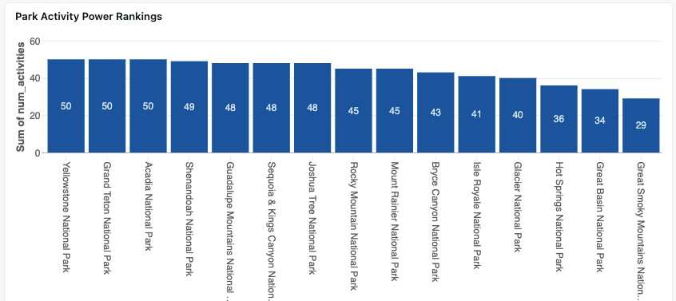

# National Parks Activity Dashboard Guide for Databricks

## Contents
- [Overview](#overview)
- [Prerequisites](#prerequisites)
- [Data Setup](#data-setup)
- [Visualization Creation](#visualization-creation)
- [Dashboard Assembly](#dashboard-assembly)
- [Maintenance](#maintenance)

## Overview

This guide details the creation of an interactive Databricks dashboard that visualizes data sourced from the National Park Service (NPS) API. The data pipeline leverages the Fivetran Connector SDK to sync National Parks data directly into your Databricks environment, where it can be analyzed and visualized using Databricks' SQL and visualization capabilities.


### Data Pipeline & Databricks Integration
The solution consists of two main components:
1. **Data Ingestion**: Custom Fivetran connector syncing NPS API data to Databricks
   - Built using the [Fivetran Connector SDK](https://github.com/yourusername/nps-fivetran-connector)
   - Retrieves data for 56 major National Parks
   - Automatically updates data in Databricks through Fivetran
   - Maintains data freshness with scheduled syncs

2. **Databricks Dashboard**: Interactive visualization suite
   - Utilizes Databricks SQL for data transformation
   - Leverages Databricks' built-in visualization tools
   - Creates an interactive, refreshable dashboard
   - Provides geographic and statistical insights

### Dashboard Components
The Databricks dashboard includes three main visualizations:
1. National Parks Activity Hub - Interactive map visualization showing activity distribution
2. Park Activity Power Rankings - Dynamic analysis of top 15 parks by activity count
3. Adventure Categories: What Parks Offer - Interactive breakdown of activity types across parks

For more details about the data pipeline and connector implementation, visit our [NPS Fivetran Connector Repository](https://github.com/yourusername/nps-fivetran-connector).

## Prerequisites

### Databricks Environment Requirements
- Access to a Databricks workspace
- Databricks SQL or higher tier workspace
- Permissions to:
  - Create and modify dashboards
  - Run SQL queries
  - Access Unity Catalog (if using)

### Data Requirements
- Fivetran connector set up and syncing data to Databricks
- Access to the following tables in your Databricks catalog:
  - parks
  - thingstodo

## Data Setup

### Important Note About Database References
Throughout this guide, you'll see the following placeholders in SQL queries:
- `<your_schema_name>` - Replace with your Fivetran connector schema name
- `<your_unity_catalog>` - Replace with your Unity Catalog name in Databricks

For example, if your:
- Fivetran connector schema is named "nps_connector_01"
- Unity Catalog is named "main_catalog"

You would replace:
```sql
FROM `<your_unity_catalog>.<your_schema_name>.parks_thingstodo`
```
with:
```sql
FROM `main_catalog.nps_connector_01.parks_thingstodo`
```

### Initial Data Transformation
First, create a combined table joining parks and activities data:

```sql
CREATE OR REPLACE TABLE <your_schema_name>.parks_thingstodo AS 
SELECT 
    t.activity_id,
    t.park_id,
    t.park_name,
    t.park_state,
    t.title as activity_title,
    t.short_description,
    t.accessibility_information,
    t.location,
    t.url,
    t.duration,
    t.tags,
    p.description as park_description,
    p.latitude,
    p.longitude,
    p.activities as park_activities,
    p.designation
FROM <your_schema_name>.thingstodo t
JOIN <your_schema_name>.parks p 
ON t.park_name = p.name;
```

### Data Verification
Run this query to verify the data:

```sql
SELECT 
    COUNT(*) as total_rows,
    COUNT(DISTINCT park_name) as unique_parks,
    COUNT(DISTINCT activity_id) as unique_activities
FROM <your_schema_name>.parks_thingstodo;
```

## Visualization Creation

### 1. National Parks Activity Hub


#### SQL Query
```sql
WITH activity_metrics AS (
  SELECT 
    park_name,
    park_state,
    latitude,
    longitude,
    COUNT(DISTINCT activity_id) as num_activities,
    array_join(collect_list(DISTINCT TRIM(activity_title)), ', ') as top_activities
  FROM `<your_unity_catalog>.<your_schema_name>.parks_thingstodo`
  WHERE latitude IS NOT NULL 
    AND longitude IS NOT NULL
  GROUP BY park_name, park_state, latitude, longitude
)
SELECT *
FROM activity_metrics
ORDER BY num_activities DESC;
```

#### Setup Instructions
1. Navigate to the Data tab
2. Run the SQL query
3. Switch to Canvas tab
4. Create new visualization:
   - Select "Point Map" type
   - Set Location Type to "Custom"
   - Configure map settings:
     * Latitude: latitude
     * Longitude: longitude
     * Size: num_activities
     * Tooltips: park_name, top_activities

### 2. Park Activity Power Rankings



#### SQL Query
```sql
SELECT 
    park_name,
    COUNT(DISTINCT activity_id) as num_activities,
    array_join(collect_list(DISTINCT TRIM(duration)), ', ') as durations
FROM `<your_unity_catalog>.<your_schema_name>.parks_thingstodo`
GROUP BY park_name
ORDER BY num_activities DESC
LIMIT 15;
```

#### Setup Instructions
1. Navigate to the Data tab
2. Run the SQL query
3. Switch to Canvas tab
4. Create new visualization:
   - Select "Bar Chart" type
   - Configure settings:
     * X-axis: park_name
     * Y-axis: num_activities
     * Sort: Descending by num_activities
     * Rotate labels: Enable x-axis label rotation

### 3. Adventure Categories: What Parks Offer


#### SQL Query
```sql
WITH exploded_tags AS (
    SELECT 
        park_name,
        explode(from_json(tags, 'ARRAY<STRING>')) as activity_type
    FROM `<your_unity_catalog>.<your_schema_name>.parks_thingstodo`
    WHERE tags != '[]'
)
SELECT 
    activity_type,
    COUNT(DISTINCT park_name) as num_parks,
    COUNT(*) as total_activities,
    array_join(collect_list(DISTINCT park_name), ', ') as parks
FROM exploded_tags
GROUP BY activity_type
ORDER BY num_parks DESC
LIMIT 15;
```

#### Setup Instructions
1. Navigate to the Data tab
2. Run the SQL query
3. Switch to Canvas tab
4. Create new visualization:
   - Select "Bar Chart" type
   - Configure settings:
     * X-axis: activity_type
     * Y-axis: total_activities
     * Color: num_parks
     * Tooltips: parks
     * Sort: Descending by total_activities
     * Rotate labels: Enable x-axis label rotation

## Dashboard Assembly

### Creating the Dashboard
1. Click "+ New Dashboard" in Databricks
2. Name the dashboard "National Parks Activity Analysis"
3. Add a description (optional)

### Adding Visualizations
1. Add "National Parks Activity Hub" map at the top
   - Set width: 12 (full width)
   - Set height: 6 units

2. Add "Park Activity Power Rankings" below map, left side
   - Set width: 6 units
   - Set height: 4 units

3. Add "Adventure Categories" below map, right side
   - Set width: 6 units
   - Set height: 4 units

### Final Configuration
1. Add titles to each visualization
2. Add descriptions if needed
3. Set refresh schedule
4. Save dashboard


## Maintenance

### Regular Tasks
- Verify data freshness weekly
- Update visualizations when data changes
- Monitor performance metrics

### Best Practices
- Document any changes made to queries
- Test new visualizations in development first
- Backup dashboard configurations
- Monitor for any broken queries or visualizations
